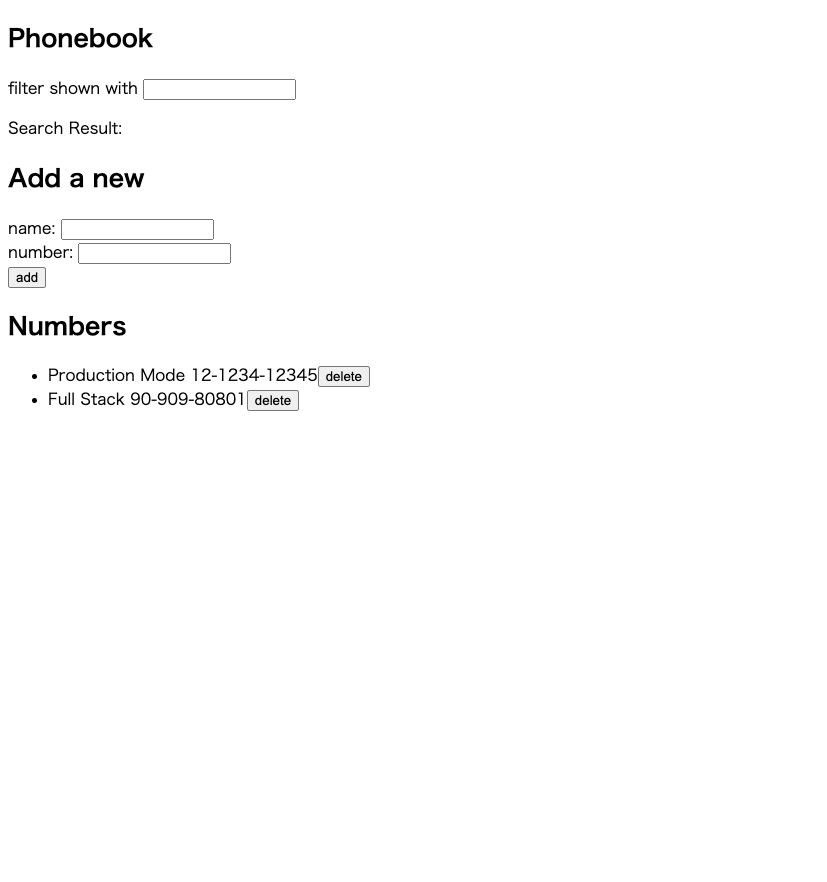

# About this repository

This is the repository for Full Stack open 2022. 
(URL:https://fullstackopen.com/en/)

I want to learn more recently FullStack technology, and I deceided to take the course.

This repository is for from Part0 to Part3 (server side).

Part0 is Fundamentals of Web apps: (URL:https://fullstackopen.com/en/part0)  
Part1 is Introduction to React : (URL:https://fullstackopen.com/en/part1)  
Part2 is Communicating with server : (URL:https://fullstackopen.com/en/part2)  
Part3 is Programming a server with NodeJS and Express : (URL:https://fullstackopen.com/en/part3)  

Through the above courses, student had to created simple phonebook SPA.
And, I finished the task.

Probably, I will delete the app in the Heroku (Because, Heroku can not create more than 5 application in the free plan).  
But as of today, the application is working in this URL (https://phonebook-fullstack-tuts.herokuapp.com/)

## ScreenShots of the project
This course is not for CSS. So, the site is not fancy...

## .env file

MONGODB_URI= "your mongodb uri here"  
PORT= "your localhost port number here"

Through the courses, I got the more knowledge of the latest web developer's world.
Fundamentals is always most important thing in the programming world.
So, I am satisfied with this course.

Thank you for reading.
And, happy coding!!!
